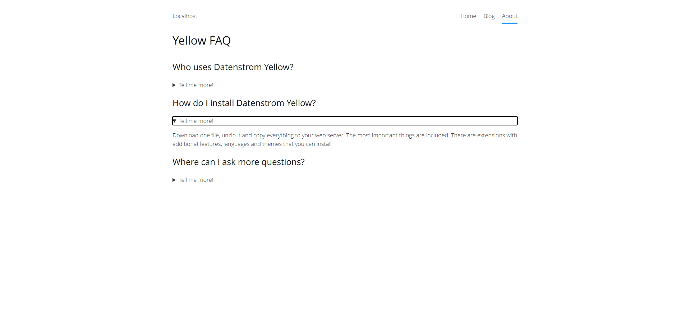

<p align="right"><a href="README-de.md">Deutsch</a> &nbsp; <a href="README.md">English</a></p>

# Spoiler 0.8.8

Bestimmte Seitenelemente verstecken.

<p align="center"></p>

## Wie man eine Erweiterung installiert

[ZIP-Datei herunterladen](https://github.com/schulle4u/yellow-spoiler/archive/refs/heads/main.zip) und in dein `system/extensions`-Verzeichnis kopieren. [Weitere Informationen zu Erweiterungen](https://github.com/annaesvensson/yellow-update/tree/main/README-de.md).

## Wie man Seiteninhalte versteckt

Erstelle einen umschlossenen Code-Block und verwende `spoiler` als Sprach-Parameter. 

## Beispiele

Inhaltsdatei mit verstecktem Textblock:

````
---
Title: Spoiler-beispiel
---
Klicke auf das Symbol zum Einblenden. 

```spoiler
Dieser Text ist standardmäßig ausgeblendet. Falls du ihn jetzt lesen kannst, hast du das richtige Symbol geklickt. Du kannst beliebigen Inhalt einfügen; Text, Links, Bilder, sogar weitere Abkürzungen sind möglich. 
```

Hier kann weiterer Inhalt stehen. 
````

## Entwickler

Steffen Schultz. [Hilfe finden](https://datenstrom.se/de/yellow/help/).
