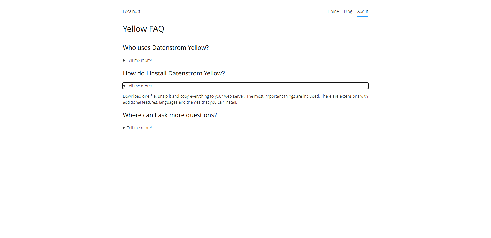

<a href="README-de.md">Deutsch</a> &nbsp; <a href="README.md">English</a>

# Spoiler 0.9.1

Hide certain page elements.

## How to install an extension

[Download ZIP file](https://github.com/schulle4u/yellow-spoiler/archive/refs/heads/main.zip) and copy it into your `system/extensions` folder. [Learn more about extensions](https://github.com/annaesvensson/yellow-update).

## How to hide page elements

Create a custom notice block and use `spoiler` as class attribute. 

## Examples

Content file with hidden text:

~~~
---
Title: Spoiler example
---
Click on the button to show the hidden text. 

! {.spoiler}
! This text is hidden.  
! **Text formatting is supported.**
! [Links and images too](https://datenstrom.se)

More text is here. 
~~~

## Developer

Steffen Schultz. [Get help](https://datenstrom.se/yellow/help/).
